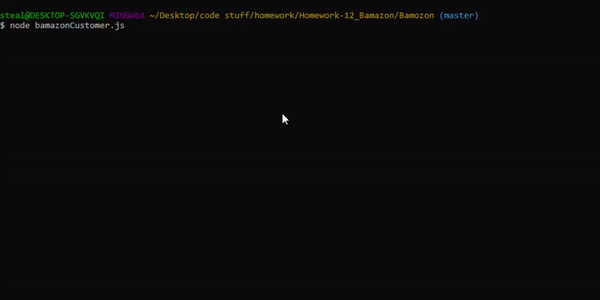
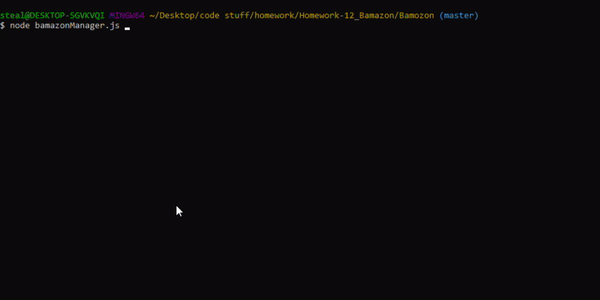

# Bamazon

Currently two distinct node apps that help customers or managments requests:

1. `bamazonCustomer.js`

2. `bamazonManager.js`

Bamazon will then output database info based on users submitted information to the console. 

***

## Bamazon Customer App

This app will take costomer orders and edit the database accordingly.

***

## Bamazon Manager App

This app offers 5 action options for managment: 

* `View Products for Sale`
* `View Low Inventory`
* `Add to Inventory` 
* `Add New Product` 
* `Exit` 

Currently only the first two and Exit are functional. 

